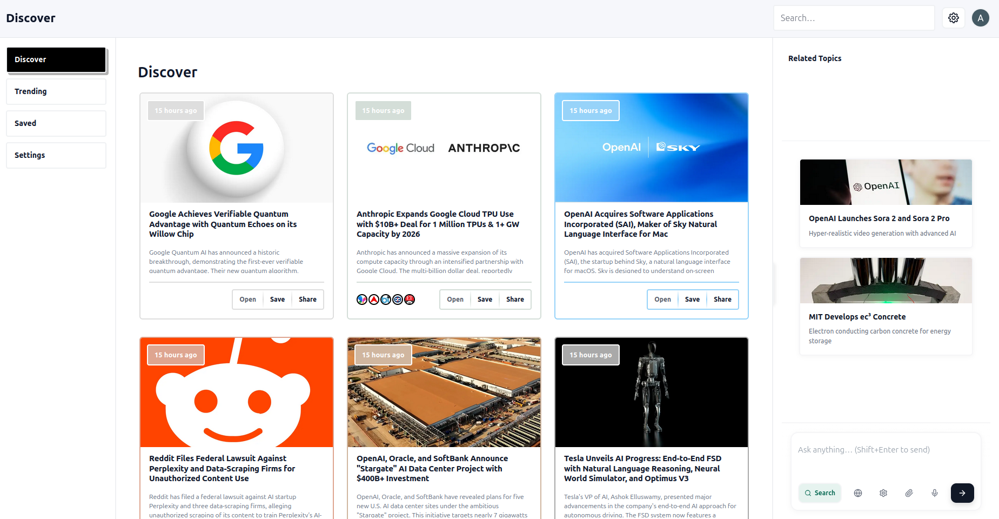

## RESNET — New UI

Modern React + Vite interface for discovering and reading news with dedicated desktop and mobile experiences.

### Access the app
- Live: [newui.resnet.in](https://newui.resnet.in)

### UI gallery

Desktop home

Mobile home

Search — keyword and results

Article details (mobile) — Summary, Options (comments), Chains (company‑only news)

Chains view

Settings

Mobile — dark mode

### Tech stack
- **React + Vite** for fast dev/build
- **Responsive layouts** with separate mobile/desktop views

### Scripts
- `npm run dev` — start dev server
- `npm run build` — production build in `dist/`
- `npm run preview` — preview the built app

### Project structure
- `src/root/App.jsx` — routes to mobile/desktop via `useResponsive`
- `src/views/mobile` — mobile screens and sections
- `src/views/desktop` — desktop screens and sections
- `src/shared` — shared components, hooks and utilities
- `src/styles` — global styles and tokens
- `public/ui-images` — UI screenshots shown above
